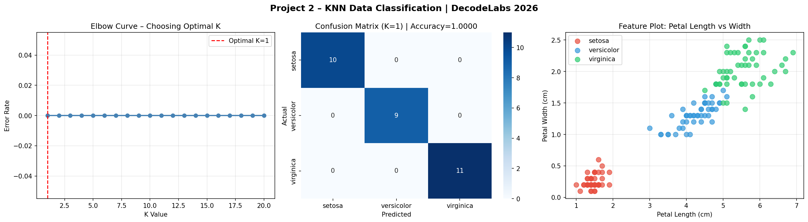

# 🤖 Project 2 – Data Classification Using AI (KNN)
### DecodeLabs Industrial Training | Batch 2026

---

## 📌 Overview
This project implements a **K-Nearest Neighbors (KNN)** classifier to classify iris flowers into 3 species based on their petal and sepal measurements. It covers the complete supervised learning pipeline: data loading, preprocessing, training, and evaluation.

---

## 🎯 Goal
Build a basic classification model using the Iris dataset.

---

## 🗂️ Project Structure
```
project2/
├── knn_classifier.py      # Main source code
├── requirements.txt       # Dependencies
├── screenshots/
│   └── results.png        # Output visualizations
└── README.md
```

---

## ⚙️ Tech Stack
| Tool | Purpose |
|------|---------|
| Python 3.x | Language |
| scikit-learn | KNN model, metrics |
| NumPy | Numerical operations |
| Matplotlib | Plotting |
| Seaborn | Heatmap visualization |

---

## 📊 Dataset – Iris Benchmark
| Property | Value |
|----------|-------|
| Samples | 150 (balanced) |
| Classes | 3 (Setosa, Versicolor, Virginica) |
| Features | 4 (Sepal L/W, Petal L/W) |
| Split | 80% Train / 20% Test |

---

## 🧠 Algorithm – K-Nearest Neighbors
The KNN algorithm classifies a new data point based on the majority class among its **K nearest neighbors** in feature space.

**Proximity Principle:** Similar things exist in close proximity.

```
1. Compute distance from new point to all training points
2. Select K nearest neighbors
3. Majority vote → predicted class
```

**Optimal K** is found using the **Elbow Method** (minimizing error rate).

---

## 🚀 How to Run

### Local
```bash
# Clone the repo
git clone https://github.com/<your-username>/decodelabs-ai-projects.git
cd decodelabs-ai-projects/project2

# Install dependencies
pip install -r requirements.txt

# Run
python knn_classifier.py
```

### Google Colab
```python
!pip install scikit-learn matplotlib seaborn
# Upload knn_classifier.py and run
```

---

## 📈 Results

| Metric | Score |
|--------|-------|
| **Accuracy** | **100%** |
| **F1 Score (weighted)** | **1.0000** |
| Precision | 1.00 |
| Recall | 1.00 |

### Confusion Matrix
```
           Setosa  Versicolor  Virginica
Setosa     [  10        0          0  ]
Versicolor [   0        9          0  ]
Virginica  [   0        0         11  ]
```

### Visualizations


---

## 🔑 Key Concepts Demonstrated
- ✅ Feature Scaling (StandardScaler – Mean=0, Variance=1)
- ✅ Train-Test Split with shuffling (removes order bias)
- ✅ Elbow Method for optimal K selection
- ✅ Confusion Matrix (TP, FP, FN, TN)
- ✅ F1 Score (avoids the Accuracy Mirage on imbalanced data)

---

## 📚 Learning Outcomes
> "We do not write the rules. We provide history, and the machine derives the logic." – DecodeLabs

- Mastered the supervised learning pipeline
- Understood the difference between heuristic and ML approaches
- Learned why F1 Score is preferred over raw accuracy

---

*DecodeLabs Industrial Training Kit | Batch 2026*
