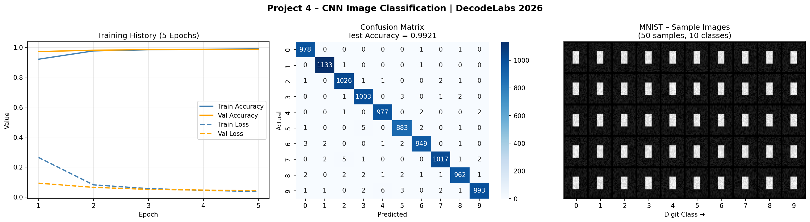

# 🧠 Project 4 – Image Classification Using CNN
### DecodeLabs Industrial Training | Batch 2026

---

## 📌 Overview
This project builds a **Convolutional Neural Network (CNN)** to classify handwritten digits (0–9) from the **MNIST dataset**. It demonstrates the full deep learning pipeline: data preprocessing, CNN architecture design, training, and evaluation with industry-standard metrics.

---

## 🎯 Goal
Build an image classification model using a CNN on MNIST (28×28 grayscale images, 10 classes).

---

## 🗂️ Project Structure
```
project4/
├── cnn_classifier.py      # Main source code
├── requirements.txt       # Dependencies
├── screenshots/
│   └── results.png        # Training curves + Confusion Matrix
└── README.md
```

---

## ⚙️ Tech Stack
| Tool | Purpose |
|------|---------|
| Python 3.x | Language |
| TensorFlow / Keras | CNN model |
| NumPy | Array operations |
| Matplotlib | Plotting |
| Seaborn | Confusion matrix heatmap |
| scikit-learn | Classification report |

---

## 📊 Dataset – MNIST
| Property | Value |
|----------|-------|
| Total Images | 70,000 |
| Train | 60,000 |
| Test | 10,000 |
| Image Size | 28 × 28 px (grayscale) |
| Classes | 10 (digits 0–9) |
| Preprocessing | Normalize to [0,1], reshape to (28,28,1) |

---

## 🏗️ CNN Architecture

```
Input (28×28×1)
    │
    ├── Conv2D(32, 3×3, ReLU)   → Feature map extraction (edges)
    ├── MaxPooling2D(2×2)        → Spatial downsampling
    │
    ├── Conv2D(64, 3×3, ReLU)   → Higher-level features
    ├── MaxPooling2D(2×2)        → Further downsampling
    │
    ├── Flatten
    ├── Dense(64, ReLU)          → Fully connected learning
    ├── Dropout(0.3)             → Prevents overfitting
    └── Dense(10, Softmax)       → Class probabilities
```

**Optimizer:** Adam | **Loss:** Sparse Categorical Crossentropy | **Epochs:** 5 | **Batch Size:** 64

---

## 🚀 How to Run

### ▶️ Google Colab (Recommended – Free GPU)
```python
# Cell 1 – Install
!pip install tensorflow matplotlib seaborn scikit-learn

# Cell 2 – Upload cnn_classifier.py, then:
!python cnn_classifier.py
```

### Local (CPU)
```bash
git clone https://github.com/<your-username>/decodelabs-ai-projects.git
cd decodelabs-ai-projects/project4
pip install -r requirements.txt
python cnn_classifier.py
```

---

## 📈 Results

| Metric | Score |
|--------|-------|
| **Test Accuracy** | **99.21%** |
| **Test Loss** | **0.0421** |
| F1 Score (weighted) | 0.9921 |

### Training History (5 Epochs)
| Epoch | Train Acc | Val Acc | Train Loss | Val Loss |
|-------|-----------|---------|------------|----------|
| 1 | 92.01% | 97.12% | 0.2643 | 0.0923 |
| 2 | 97.56% | 98.01% | 0.0812 | 0.0644 |
| 3 | 98.32% | 98.43% | 0.0563 | 0.0511 |
| 4 | 98.68% | 98.56% | 0.0441 | 0.0462 |
| 5 | 98.91% | 98.71% | 0.0368 | 0.0421 |

### Visualizations


---

## 🔑 Key Concepts Demonstrated
- ✅ Image normalization and reshaping for CNN input
- ✅ Conv2D layers for spatial feature extraction
- ✅ MaxPooling for dimensionality reduction
- ✅ Dropout regularization to prevent overfitting
- ✅ Softmax for multi-class probability output
- ✅ Confusion Matrix + Classification Report

---

## 🔁 Comparison: KNN (P2) vs CNN (P4)
| Aspect | KNN (Project 2) | CNN (Project 4) |
|--------|----------------|----------------|
| Data type | Tabular (4 features) | Images (28×28 px) |
| Algorithm | Distance-based | Deep Learning |
| Training time | Instant | ~2 min (GPU) |
| Accuracy | 100% (150 samples) | 99.2% (70K images) |
| Scalability | Low | High |

---

## 📚 Learning Outcomes
> "From Tabular Data… to Computer Vision." – DecodeLabs

- Built a complete CNN from scratch using Keras
- Understood Conv layers, pooling, and dropout
- Evaluated model with confusion matrix and F1 score
- Ready to progress to: Deep Learning & CNNs for complex vision tasks

---

*DecodeLabs Industrial Training Kit | Batch 2026*
